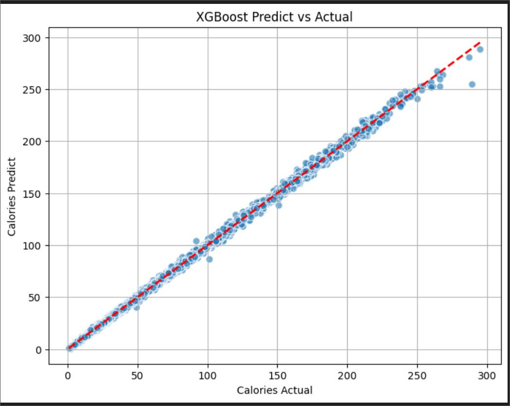

# 🔥 Calories Prediction App 🥗⚡

[](https://www.python.org/)  
[](https://calories-prediction-9k3nbthttphmqysnzlwsnz.streamlit.app/)  
[](https://youtu.be/082eVOTRcy8?si=6U7zqx-Dav3cKDxZ)  

🌟 **Try the Live App Now:** [Open Streamlit App](https://calories-prediction-9k3nbthttphmqysnzlwsnz.streamlit.app/)  

---

## ✨ Overview
A **machine learning web application** that predicts the number of **calories burned** based on user activity inputs.  
Built with **Streamlit** for interactivity and **XGBoost** for fast and accurate predictions.  
Perfect for fitness enthusiasts, nutritionists, and anyone tracking energy expenditure.  

---

## 🏃 Features & Advantages

**Features (Input Parameters for Prediction):**  
- 👶 **Age** (years)  
- 🧑‍🦱 **Gender** (male/female)  
- 📏 **Height** (cm)  
- ⚖️ **Weight** (kg)  
- ⏱️ **Exercise Duration** (minutes)  
- 💓 **Average Heart Rate** (bpm)  
- 🌡️ **Body Temperature** (°C)  

**Advantages:**  
- ✅ Simple, clean, and responsive web interface  
- ✅ Fast, lightweight ML inference  
- ✅ Mobile-friendly  
- ✅ Easy to extend with custom datasets or multiple models  
- ✅ Deployed online via Streamlit  

---

## 🎬 Demo

- 🌍 **Live App**: [Try it here!](https://calories-prediction-9k3nbthttphmqysnzlwsnz.streamlit.app/)  
- 🎥 **Video Walkthrough**: [Watch on YouTube](https://youtu.be/082eVOTRcy8?si=6U7zqx-Dav3cKDxZ)  
- 🖼️ **Screenshots**: See [`/screenshots`](./screenshots)  

Example Screenshot:  
  

💡 **Tip**: You can **run the app instantly in your browser** without installing anything:  
[Click here to open the live Streamlit app](https://calories-prediction-9k3nbthttphmqysnzlwsnz.streamlit.app/)

---

## 🛠️ Tech Stack
- **Python 3.10+**  
- **Streamlit** (Frontend/UI)  
- **Pandas, NumPy** (Data processing)  
- **Scikit-learn** (Preprocessing & pipeline)  
- **XGBoost** (Prediction model)  
- **Joblib** (Model serialization)  

---

## 🚀 How to Run Locally

### Step 1: Clone the repository
```bash
git clone https://github.com/colinwilson06/calories-prediction.git
cd calories-prediction
```

### Step 2: Install dependencies
```bash
pip install -r requirements.txt
```

### Step 3: Run the application
```bash
streamlit run app.py
```

---

## 📂 Project Structure
```bash
calories-prediction/
│
├── demo/               # demo video files
├── screenshots/        # app screenshots
├── app.py              # main Streamlit app
├── model.pkl           # trained ML model
├── scaler_X.pkl        # input scaler
├── scaler_y.pkl        # output scaler
├── requirements.txt    # dependencies
└── README.md           # documentation
```

## 📊 Model Overview

- Algorithm: XGBoost Regressor
- Preprocessing: Scaling input & output features using Scikit-learn
 -Output: Predicted calories burned displayed directly on screen

**Future improvements:**

- Add multiple ML models for comparison
- Visualize prediction errors and metrics
- Allow users to upload custom datasets

👤 Author
Created by Colin Wilson 👨‍💻

📫 Contact: colinwilson06@gmail.com
